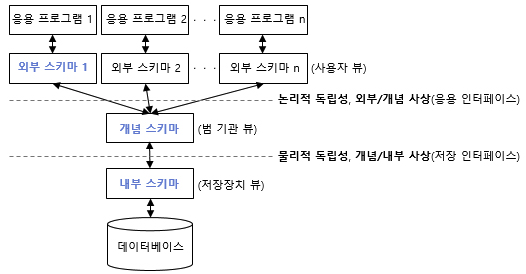
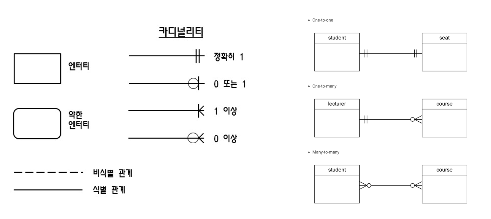

## 1-1.모델링의 개념

### 모델링
- 모델을 만드는 것 (사물 or 개념을 약속된 표기법으로 도식화 한 것)
- 추상화를 기본으로 함
- 데이터베이스를 설계하는 것도 하나의 모델링

`추상화 : 사물의 특징을 추려서 단순화 하는 것`

 

## 1-2.모델링의 특징

### 추상화 Abstraction
- 대상을 범주화 해서 클래스로 구분
- 주요 특징을 추출해서 일정한 형식으로 표현

### 단순화 Simplification
- UML, ERD
- 약속된 표기법으로 단순하게 표현

### 명확화 Clarity
- 서로 다른 해석 x

> <strong>데이터 모델링 시 유의사항</strong>   1. 중복 최소화   2. 비유연성 최소화   3. 비일관성 최소화

 

## 1-3.모델링의 세가지 관점

### 데이터 관점 What
- 어떤 데이터들이 서로 관계를 맺고 사용 되는지
- 정적분석, 구조분석

### 프로세스 관점 How
- 일이 어떻게 처리되는지
- 동적분석, 도메인분석

### 데이터와 프로세스의 상관 관점
- 데이터와 프로세스가 서로 어떻게 관계를 맺고 영향을 주고 받는지
- CRUD 분석을 기반

 

## 1-4.모델링의 세가지 단계
데이터 모델링은 <strong>거시적, 포괄적 수준에서 점차 상세한 수준으로..</strong>

### 개념적 데이터 모델링
- 가장 높은 추상화 레벨
- EA 수립할 때 많이 이용
- 엔터티 Entity와 속성 Attribute을 도출

### 논리적 데이터 모델링
- 재사용성이 높음
- 정규화를 통해 중복 데이터를 최소화
- 키 Key, 속성 Attribute, 관계 Relationship 표현
- 식별자 도출, 관계를 정의

### 물리적 데이터 모델링
- 가장 낮은 추상화 레벨
- 성능 향상을 위해 반정규화 수행
- 테이블, 인덱스, 함수 생성

 

## 1-5.ANSI-SPARC에서 정의한 3단계 스키마 구조
1975년 DBMS의 추상적인 설계표준으로 제안
 
데이터 독립성을 보장하기 위한 설계방법 제시

> 데이터를 사용하는 사용자 영역과 실제 데이터를 저장하는 디스크, 메모리 영역을 서로 분리  
> 데이터 구조나 형식을 독립적으로 설계, 운용

### 외부 스키마 External Schema
- 사용자 관점
- 다중 사용자뷰 제공

### 개념 스키마 Conceptual Schema
- 설계자 관점
- 모든 사용자가 바라보는 데이터베이스 스키마를 통합하여 나타냄
- 전체 데이터베이스에 저장되는 데이터와 그 관계 정의
- 통합된 뷰 제공

### 내부 스키마 Internal Schema
- 개발자 관점 `SQL문을 작성하는 개발자`
- 디스크나 메모리 상의 물리적, 실질적 저장구조
- 테이블, 칼럼, 인덱스 등 정의

 

## 1-6.ERD
시스템 분석 ・ 설계의 결과를 가시화, 문서화, 명세화하여 사용자, 설계자, 개발자 간의 의사소통 수단

 

> <strong>엔터티</strong>
 
> 엔터티는 박스로 나타냄
 
> 엔터티 이름은 박스 상단에 표시

> <strong>카디널리티</strong>
 
> 까치발이라 부르는 관계
 
> O은 0(숫자 0), 세로 실선은 1, 세개의 까치발은 다수(2 이상) 의미

> <strong>속성</strong>
 
> 박스 안에 리스트 형태로 표현
 
> 주식별자(PK)와 일반 속성은 칸막이로 구분

> <strong>관계</strong>
 
> 박스를 연결한 선으로 표현
 
> 식별자 관계는 실선, 비식별자 관계는 점선 표시

 

### ERD 작성순서
1. 엔터티를 도출
2. 도출된 엔터티 배치 `중요한 엔터티는 왼쪽 상단 배치`
3. 엔터티 간의 관계 설정
4. 관계명 기술
5. 관계의 참여도 기술 (일대일, 일대다, 다대다)
6. 관계 필수/선택 기술 (Null 값 여부)